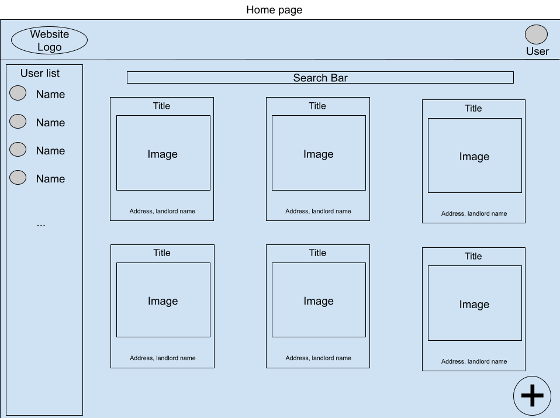
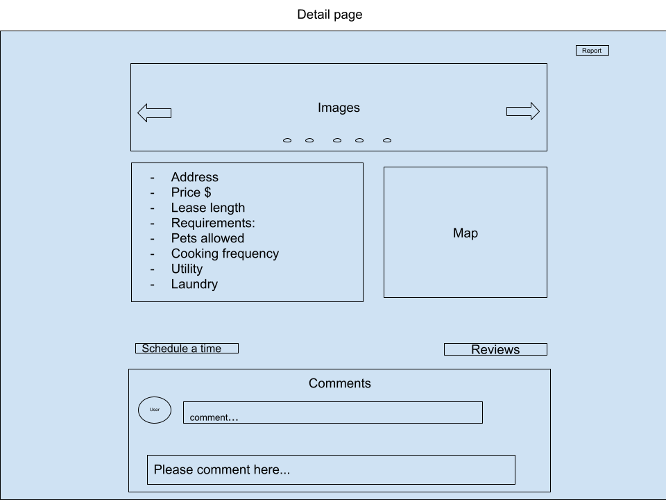
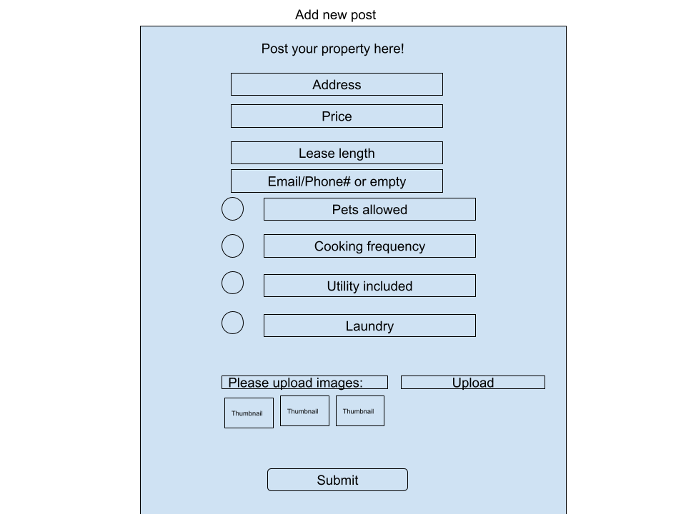

# Team1-Project
## `Project Description` 
VanHouse is an app for landlords and prospective tenants to find and rent property. Landlords can post property listings including details and images. Users can search for properties that match their criteria, review/comment on listings, and contact landlords to arrange meetings.

## `Project Proposal`
We plan to build an app for landlords and prospective tenants to rent property. Landlords (or tenants looking for roommates) will post property listings including details and images. Interested tenants can schedule meetings with the poster. We will include review and comment functionality for each listing and build a booking tool to help with scheduling meetings between prospective tenants and landlords.

## `Who is it for?`
- Renters
- Landlords/Hosts (other tenants looking for roommates)

## `What will it do?`
The website will support users in publishing available apartments/houses/rooms for rent, including attaching images or videos of the properties. It will also facilitate online communication between users (landlords/hosts and tenants) via comments/DMs.

## `What type of data will it store?`
- House/Apartment (id, location - coords, price, contacts, lease length, no pet/cooking frequency…)
- Landlord (id, full name, real estates they own, current tenants, reviews…)
- Tenants (id, full name, current living place, reviews…)
- Scheduled meetings (time, host, renters, property id)

## `What will users be able to do with this data?`
- Users will be able to schedule meetings between tenants and landlords.
- Users will be able to view properties/rooms that are similar to the one they are currently looking at.

## `What is some additional functionality you can add/remove based on time constraints?`
- Landlords can review their tenants and vice versa.
- A DM system that landlords/tenants can chat on. 
- For each post, we will use a map to display the location of property so users can have a sense where the property is exactly. 

## `Project task requirements:`
### `3-5 minimal requirements`
- Hosts will be able to create, read, update, and delete postings about their real estate properties.
- The website will facilitate scheduling of meetings between hosts/tenants.
- Users will be able to search for properties according to different filters and sort the results in several different ways.
- Users will be able to log into or sign up for an account on the website.

### `3-7 "standard" requirements (will most likely complete)`
- Properties will have a map API on their details page so users can easily discern where they are.
- Tenants will be able to post reviews of properties they have stayed at, and hosts will be able to review their tenants. 
- Users will be able to post comments on property detail pages. 
- Each user and property will have a “Report” function on their page. 
- Hosts will be able to upload images of their properties.

### `2-3 stretch requirements (plan to complete at least 1!)`
- Users will be able to send direct messages to other users. 
- Users will be able to search by keyword (instead of just by location or specific address and then filtering). 

## `Pick 2 of your minimal requirements and break each of them down into ~2-5 smaller tasks!`
- Create, read, update, delete posted real estates
  - Front-end: a create button, a button to delete post, a form to edit post
  - Back-end: Renters to handle create, edit and delete requests.
  - UI: use CSS to beautify our front-end
  - UX: make a wireframe/figma
- Schedule visiting/meeting between hosts/tenants
  - Front-end: a form to send a meeting request. Landlord can choose to accept or decline
  - Back-end: user can create records for scheduled meetings
  - UI/UX: To sketch a form and apply CSS styles
- Log in/sign up
  - Front-end: Log in/sign up buttons, forgot password buttons, display info after logging in.
  - Back-end: Authentication, authorization (user validation is required)

### `P.S. We used Google Drawing to make our sketches instead of on paper because it's easier for us to collaborate remotely.`

